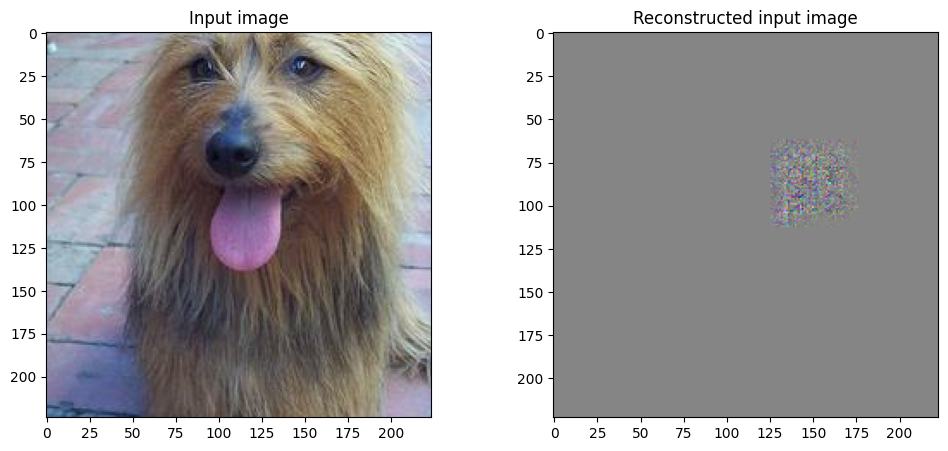
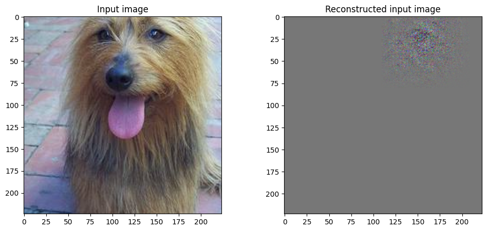
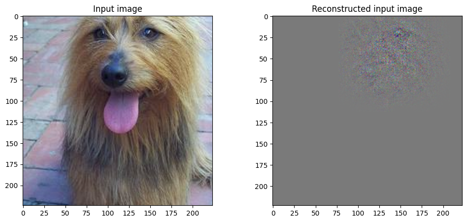
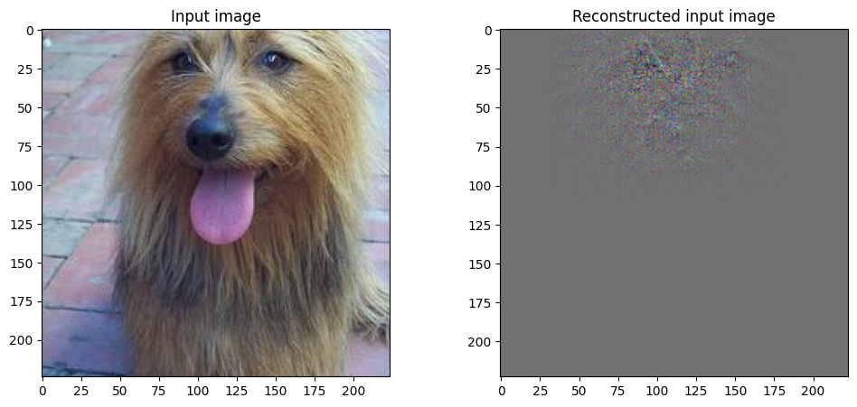
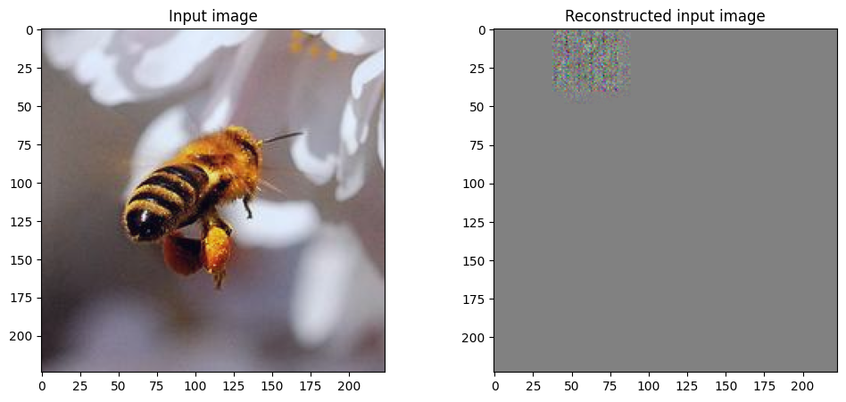
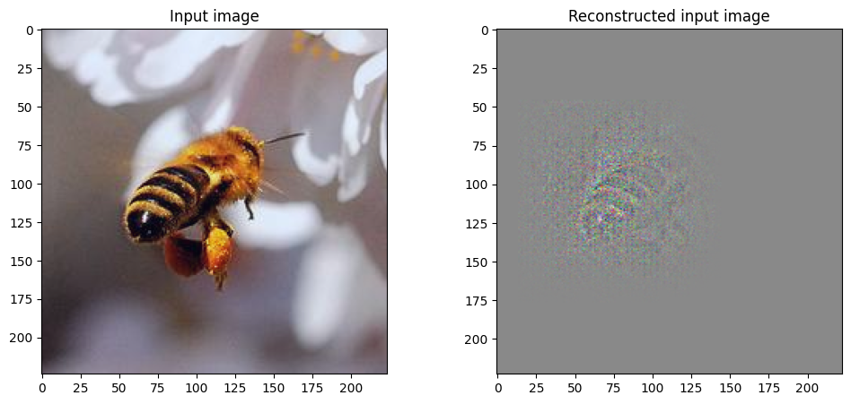
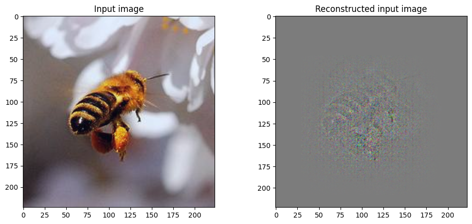

# Implementation of Visualizing and Understanding Convolutional Networks (ECCV2014)

- Paper: https://arxiv.org/abs/1311.2901
- Implementation: https://www.kaggle.com/code/thaimeuu/visualizing-zeiler-2013-implementation
- Result:

    
